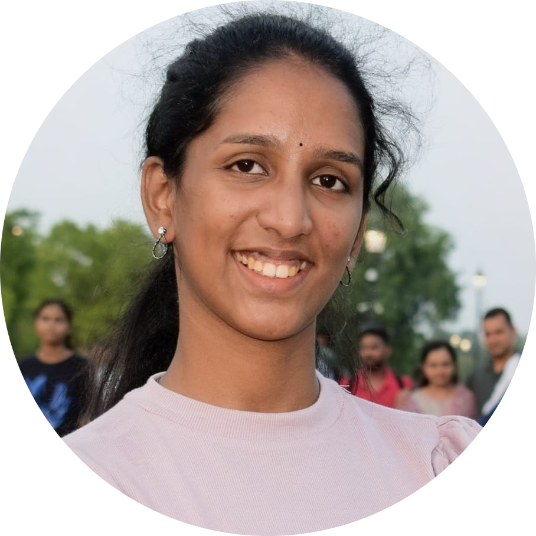

<h1 align="center">Hi, I'm <b>Sravya Lakshmi Tulasi</b> 👋</h1>

<h3 align="center">
Electronics & Communication Engineering Student
</h3>

<b>VLSI • RTL Design • FPGA • Machine Learning • Edge AI</b>

---

 

---

# 👩‍💻 Engineering Profile

I am an **Electronics & Communication Engineering** undergraduate at **Shri Vishnu Engineering College for Women** with a **CGPA of 9.58**.

My interests lie at the intersection of **VLSI Design, RTL Development, FPGA Computing, Machine Learning, Edge AI and Semiconductor Technologies**. I enjoy building intelligent hardware–AI solutions through research, practical implementation and continuous learning.

---

# 🎯 Areas of Interest

- ⚡ RTL Design
- 🖥 FPGA Development
- 🤖 Machine Learning
- 🔬 Semiconductor Technologies
- 📷 Computer Vision
- 🌐 Edge AI
- 📡 Digital System Design

---

# 🛠 Technical Skills

### Programming

### AI & Machine Learning

- Machine Learning
- Computer Vision
- YOLOv8
- CNN
- MobileNetV2
- Random Forest
- XGBoost
- ONNX

### Semiconductor & FPGA

- RTL Design
- FSM Design
- Digital Logic Design
- Static Timing Analysis
- RTL to GDSII Flow
- Physical Design (Learning)
- PYNQ-Z2
- ZCU104

### Tools

---

# 💼 Experience

### 🏢 NIELIT eChipHub Technical Internship (Jun 2026 – Present)

- RTL Design
- IP Integration
- RTL-to-GDSII Flow
- Static Timing Analysis
- Physical Design

### ⚡ FPGA & Edge AI Deployment Intern — Edgeyentra AI Tech Solutions

Worked on FPGA acceleration, Edge AI applications, Raspberry Pi, Jetson Nano, PYNQ-Z2 and intelligent vehicle monitoring.

---

# 🚀 Featured Projects

| Project | Highlights |
|---------|------------|
| 🚌 APSRTC AI Route Optimization | Random Forest, XGBoost, Demand Forecasting |
| 📷 FPGA Live Face Detection | PYNQ-Z2, USB Camera, FPGA Acceleration |
| 🧪 Wafer Defect Classification | MobileNetV2, ONNX, 93.29% Accuracy |
| 🌊 FloodWatch AI | YOLOv8, CNN, IoT, 94.2% Accuracy |
| 🚗 Intelligent Fleet Monitoring | OBD, GSM, GPS, Telemetry |
| ♿ Braille Learning Tool | Sensor-based Assistive Learning |

---

# 📑 Research

- **Intelligent Beamforming using Machine Learning for 6G IoT Networks** — ICICS 2026
- **Geometrically Modified Multiband Microstrip Patch Antenna for 5G Communication Systems** — WAMS 2026

---

# 📜 Patent Publications

🇮🇳 **4 Indian Patent Publications (2026)**

---

# 🏆 Achievements

- 🥇 Amazon ML Summer School 2026 – Selected
- 🏅 GATE 2026 – Qualified
- 🏆 IEEE YESIST12 2026 – Finalist
- 🚀 RTIH AI Hackathon – Finalist
- 💡 Yukti Innovation Challenge – Finalist
- 🏅 MSME Hackathon 5.0 – Finalist
- ⭐ Institutional Academic Topper (3rd Place)
- 🥈 ISTE Project Expo – Runner-up

---

# 📚 Certifications

- VLSI Design – HCL Tech (Ongoing)
- Samsung ISWDP Fellowship
- NPTEL – System Design Through Verilog
- NPTEL – Digital System Design
- MATLAB – MathWorks
- HackerRank Python (Basic)
- Google Crash Course on Python

---

# 👩‍💼 Leadership

- Treasurer — IEEE Student Branch SVECW
- Innovation Ambassador — Institution Innovation Council
- Student Coordinator — SDG Club
- Member — Assistive Technology Lab

---

# 📄 Resume

---

# 📫 Connect With Me

- 💼 LinkedIn: https://www.linkedin.com/in/sravya-valluri
- 📧 Email: sravyalakshmitulasivalluri@gmail.com
- 🐙 GitHub: https://github.com/Sravya-1818

---

### **"Driven by Curiosity. Powered by Innovation. Focused on Semiconductor Intelligence."**

